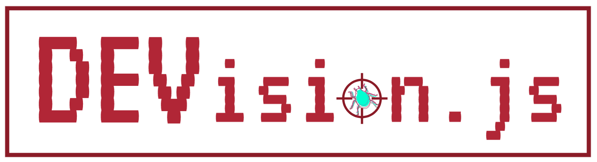

<p align="center">
  
</p>

DEVision is intended as a drop-in replacement for console.log, with the following features:
 - Fast
 - Isomorphic
 - Elegant API
 - Browser/Platform Independent
 - *... did we mention, Fast?*
# Table of contents
[TOC]
# DEVision.js Overview #
## Problem ##
 - No run-time debug tracking in JavaScript that's browser and platform independent.
 - Currently all console.log messages will run into one another & overlap
 - Once done with console.logs, need to comment / uncomment  may lead to errors
 - No “history” of a variable’s value and “tracing” done manually
 - No “diff’ing” to visually highlight the changes
 - Tracing (during development) & Testing (post development) usually violate the DRY concept in work flow context
## Solution ##
 - An improved console.log replacement allowing the developer to decide (at run-time)* what will be logged based on both priority level & user-defined scope with the ability to track/snapshot variable values and test their values.


# DEVision.js Setup #
#### Usage in Node.js
```js
const dev = require(devision.js);
```
#### Usage in Front-End
```html
<head>
    <script src="../devision/linkedList.js"></script>
    <script src="../devision/testViewHTML.js"></script>
    <script src="../devision/testView.js"></script>
    <script src="../devision/devision.js"></script>
</head>
```

# DEVision.js HowTo #
## Usage in General ☺
In fullfilling DEVision's primary purpose of being a drop-in replacement for ```console.log``` it is easiest to think of it as a Log Butler that takes care of your diagnostic household.  As is the Butler, it will be the gatekeeper for access to your logs.  There are two primary methods (during runtime) which allow you to control your diagnostic data flow:
```
    dev.currentPriority = 0;
    dev.currentScope = ['global', 'appRunTime', 'dataIO', 'foo', ];
```
**```currentPriority```** is a threshold for logging without semantic (context) info beyond the severity of the message to be logged.  The implicit (automatic) default level for both ```dev.currentPriority``` && ```dev.log(...)``` is 0 for all logged data.  Therefore, should you use only ```dev.log(...)``` without specifying a priority (as the second argument) you will be able to turn off **all** console logs by simply setting:
```
    dev.currentPriority = 1;
```
... this value can be changed either at the terminal in your application, or if on the front end, in a dynamically loaded HTML interface.
**```currentScope```** is similarly a permissive filter for your data...  it will allow any data to be displayed that contains the same scope tag(s) as currently within the ```dev.currentScope[]``` array to be displayed.
Let's look at a very simple example:
```js
dev.log("Developer Debug Message");
dev.log("Database Connection Successful <*important status update*>", 13, 'db');
dev.log("File Write Failure <*critical alert/error*>", 42, ['error', 'devOps']);
dev.log("Database Connection Failure <*critical alert/error*>", 42, ['error', 'db', 'network']);
```
Given the defaults of ```currentPriority===0``` && ```currentScope===[]``` the output would be:
```js
Developer Debug Message
File Write Failure <*critical alert/error*>
Database Connection Successful <*important status update*>
Database Connection Failure <*critical alert/error*>
```
Given ```currentPriority===42``` && ```currentScope===[]``` the output would be:
```js
File Write Failure <*critical alert/error*>
Database Connection Failure <*critical alert/error*>
```
Given ```currentPriority===99``` && ```currentScope===['db']``` the output would be:
```js
Database Connection Successful <*important status update*>
Database Connection Failure <*critical alert/error*>
```
**...** noting that we can achieve the same "goal" of only seeing the "high priority" items in the second & third examples; however, the first shows only by severity (both file && db) whereas the latter only shows based upon the contextual 'db' scope.


## DEVision.js API
### dev.log(...) → drop-in replacement for console.log(...)
```js
//  exp === ExpressionToBeLogged
//  dev.log(exp);  // example
let x = 13;
dev.log("x === " + x);

//--->   x === 13
----------

//  clcsv === console.log style comma delimited expressions
//  note:  the [] surrounding clcsv are required for this functionality
//  dev.log([clcsv]);  // example
let y = {someNum:13};
dev.log(["y === ", y]);

//--->   y === ▶ Object { someNum: 13 }

----------

//  dev.log(<exp||clcsv>, priority = 0, scope);  // example
let w = 12;
let x = 13;
dev.currentPriority = x;
dev.log("w === " + w, w);
dev.log("x === " + x, x);

//--->   x === 13

```
### dev.peek({...}) → 'wrappers' dev.log(...) output with "varName === varVal" formatting
```js
dev.peek(...);
```
### dev.passThru(...) → an "in-line" log ... it returns what's being logged
```js
dev.passThru(...);
```
### dev.trace(...) → used to track an object's value at a specific point in code
```js
dev.trace(...);
```
### dev.track(..., true|false) → used to track an object's values until turned off (true|false)
```js
dev.track(...);
```
### dev.test(...) → used to generate Tape Test files (and in the future, possibly code coverage)
```js
dev.test(testObj, dev.end);
```
### dev.end → property used by dev.test(...)
```js
dev.test(..., dev.end);
```
### dev.watch(...) → everything but test
```js
dev.watch(...);
```
### dev.all(...) → "full-monty" dev function, same as calling [log && track &&|| test]
```js
// ... === <exp||clcsv>, testObj, priority = 0, scope
dev.watch(..., dev.end);
```
## dev Utils
### dev.JSs(...) → JSON.stringify(...)
```js
dev.JSs(...);
```
### dev.JSp(...) → JSON.parse(...)
```js
dev.JSp(...);
```
### dev.vw() → Launch dev Viewer
```js
dev.vw(...);
```

## Authors
    [Ben](https://github.com/benizra2)
    [George](https://github.com/PracticalCode)
    [Jacqueline](https://github.com/jqw-chang)

## License
This project is licensed under the MIT License